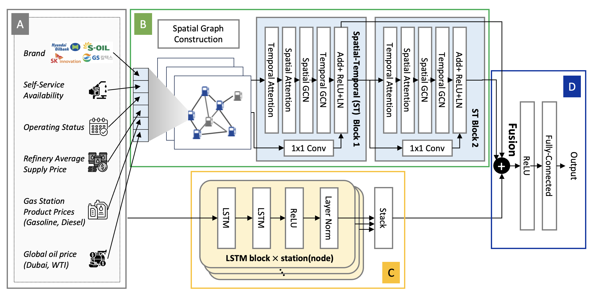

# STAD-GCN: Spatial-Temporal Attention-based Dynamic Graph Convolutional Network for Market Price Prediction
We introduce STAD-GCN, a pioneering model that integrates temporal and spatial elements within a graph-based framework. This fusion amplifies our understanding of market dynamics and the factors influencing price determination. 

The below figure is the Architectural Overview of STAD-GCN: Multimodal Fusion with ASTGCN and LSTM for Retail Gasoline Price Prediction is outlined as follows: (A) Preprocessing: Input data is preprocessed based on its characteristics. It is formatted as a graph-based time series and routed to (B), while also treated as a standard time series sent to (C). (B) Spatial-Temporal (ST) Blocks: Within (B), the data undergoes processing via two ST blocks, correlating to the number of nodes. These blocks handle the data, ultimately stacking the resultant vectors. (C) Final Prediction: The vectors from the previous step are directed to (D) for final prediction. (D) Prediction Generation: In this phase, the received vectors are concatenated and processed through a fully-connected layer, generating the ultimate predicted values.

<p align="center"></p>

# Requirements
```
python==3.10.12
cuda==11.8
pytorch==2.1.0
```

# Datasets
We have sampled ten gas stations each from the two cities tested, Seoul and Busan, and uploaded data corresponding to price and status over a ten-day period for each station. Additionally, international crude oil prices and refinery supply prices have also been sampled for the same duration.
If you wish to access more data, please visit the following site.
[Opinet](https://www.opinet.co.kr/user/main/mainView.do), the official website of the South Korea National Oil Corporation.


# Model Parameters
- learning_rate: Initial learing rate
- batch_size: batch size
- epochs: The number of epochs for training
- window: The number of sequential data points used as input for the model.
- horizon: specifies the time step in the future for which the model will predict, not a range but a single future point.
- df_price: dataset of price
- df_dist: dataset of distance between stations
- df_macroeconomics: dataset of international crude oil prices and refinery supply prices.
- col_list = column list of all features
- cat_list = column list of categorical features
- lstm_hidden_dim: number of hidden dimension of LSTM module
- lstm_num_layers: number of LSTM layers
- nb_block: number of ASTGCN blocks in the submodule
- K: Degree of Chebyshev polynomial
- nb_chev_filter: number of output filters in Chebyshev convolution
- nb_time_filter: number of output filters in temporal convolution
- time_strides: stride of the temporal convolution
- num_for_predict: number of steps to predict
- save_path: save path for model
- device: CPU/GPU
